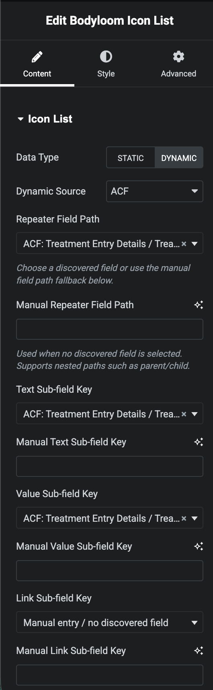
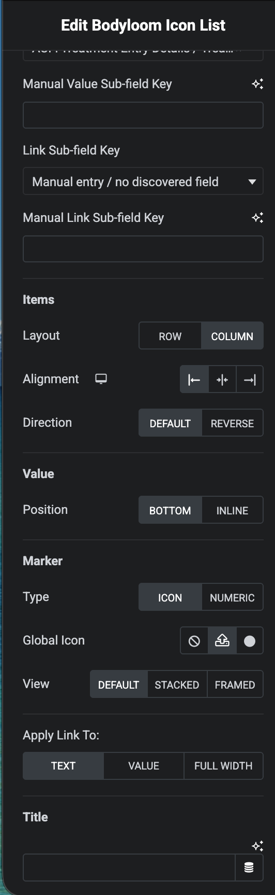

# Bodyloom Dynamic Icon List

**Contributors:** Jimmy Thanki  
**Tags:** icon list, acf, metabox, pods, elementor  
**Requires at least:** 5.0  
**Tested up to:** 7.0  
**Requires PHP:** 7.4  
**Stable tag:** 1.1.0  
**License:** GPLv2 or later  

Bodyloom Dynamic Icon List creates static and dynamic icon lists for Elementor, the Block Editor, and shortcodes.

## Features

- Elementor widget for manually managed static icon lists.
- Dynamic repeater output from ACF Pro, Meta Box, or Pods.
- Editor field pickers for discovered repeater and subfield paths.
- Manual field-path fallbacks when discovery is unavailable or custom paths are preferred.
- Layout, marker, spacing, color, typography, and link controls.
- Gutenberg block and shortcode rendering for non-Elementor layouts.
- Dynamic Elementor rendering marked for cache-aware output.
- Defensive provider handling so missing ACF, Meta Box, Pods, or Elementor dependencies do not fatal the site.

## Good Karma Donation
If you found this free plugin to be useful, please consider donating to the dhamma.org Vipassana Meditation organization founded by Sri S.N. Goenka. They provide free meditation retreats to help people ease their suffering and purify their minds, and they operate purely on volunteer work and donations. I will upload my donation receipts on an appropriate cadence if you go through my link, or you may donate directly by following instructions on <a href="https://www.dhamma.org/en/dana" target="_blank">this page</a>.


[](https://www.buymeacoffee.com/aluma)


## Installation

1. Upload `bodyloom-dynamic-icon-list` to `/wp-content/plugins/`.
2. Activate the plugin in WordPress.
3. Add the Bodyloom Icon List widget, block, or shortcode.

## Usage

Elementor: use the "Bodyloom Icon List" widget. Choose Static for hand-authored items or Dynamic for ACF Pro, Meta Box, or Pods repeater data.

Block Editor: use the "Bodyloom Icon List" block and configure the source, repeater field, text field, value field, and optional link field.

Shortcode:

```text
[bodyloom_icon_list data_type="dynamic" dynamic_source="acf" acf_repeater_field_name="my_repeater" dynamic_text_sub_field="text" dynamic_value_sub_field="value" dynamic_link_sub_field="link"]
```

Field pickers are convenience controls. Manual fields remain available for compatibility, nested field paths, and providers or field layouts that cannot be discovered safely.

## Screenshots

*Rendered Frontend Example*


*Elementor Elements Panel*


*Content Edit Panel*



*Additional Content Controls*




## Changelog

### 1.1.0

- Added editor field pickers with manual field-path fallbacks.
- Added provider support for ACF Pro, Meta Box, and Pods repeater data.
- Marked dynamic Elementor output as dynamic for cache compatibility.
- Improved block editor metadata and release packaging readiness.
- Hardened rendering and metadata for WordPress.org submission.
- Updated screenshot references and documentation for the v1.1.0 feature set.

### 1.0.0

- Initial release.
